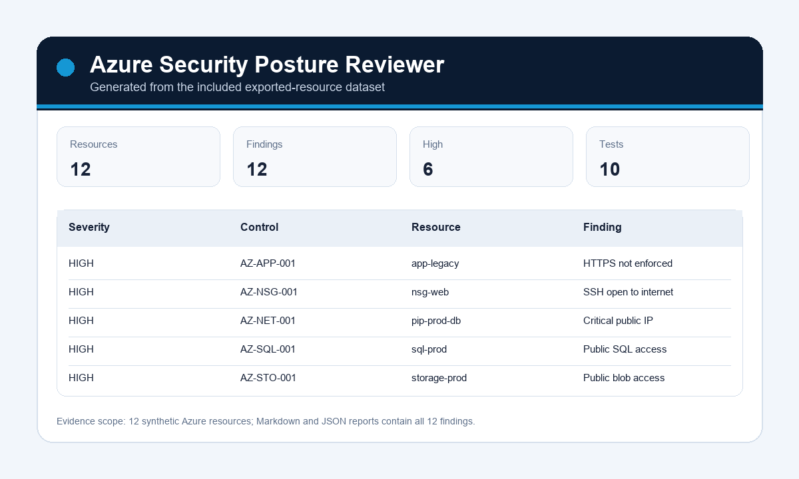

# Azure Security Posture Reviewer


Azure Security Posture Reviewer is a defensive cloud security project that reviews safe exported Azure resource data for common misconfigurations.

## Screenshot



## Employer Review

| Area | Evidence |
| --- | --- |
| Target role | Cloud Security / Junior Cyber Security Analyst |
| Strongest proof | Azure posture checks, example findings, remediation guide, unit tests |
| Start here | [reports/example_findings.md](reports/example_findings.md) |
| Deeper review | [docs/employer-review.md](docs/employer-review.md) |
| Roadmap | [docs/roadmap.md](docs/roadmap.md) |

It focuses on entry-level cloud security analyst skills:

- Reviewing storage account exposure.
- Checking network security group rules.
- Identifying risky public IP and management access patterns.
- Reviewing Key Vault soft-delete and purge protection.
- Producing clear remediation guidance.
- Testing posture checks against synthetic data.

## Why This Helps Employers

Cloud security roles need people who can explain risk clearly, not just run tools. This project shows I can review cloud configuration, prioritize findings, and write remediation advice a technical team can act on.

## Checks Included

| Check | Risk |
| --- | --- |
| Public blob access enabled | Data exposure |
| Storage account missing secure transfer | Insecure transport |
| NSG allows SSH/RDP from internet | Management exposure |
| Key Vault purge protection disabled | Weak recovery and ransomware resilience |
| Public IP on sensitive workload | Increased attack surface |

## Quick Start

```bash
python -m venv .venv
.venv\Scripts\activate
pip install -e .
python -m azure_security_posture_reviewer.reviewer
python -m unittest discover -s tests -v
```

## Example Output

```text
HIGH storage-prod Public blob access is enabled
HIGH nsg-web SSH/RDP is open to the internet
MEDIUM kv-prod Key Vault purge protection is disabled
```

## Responsible Use

This project reviews provided JSON exports only. It does not connect to live Azure subscriptions, change cloud resources, or perform intrusive testing.

